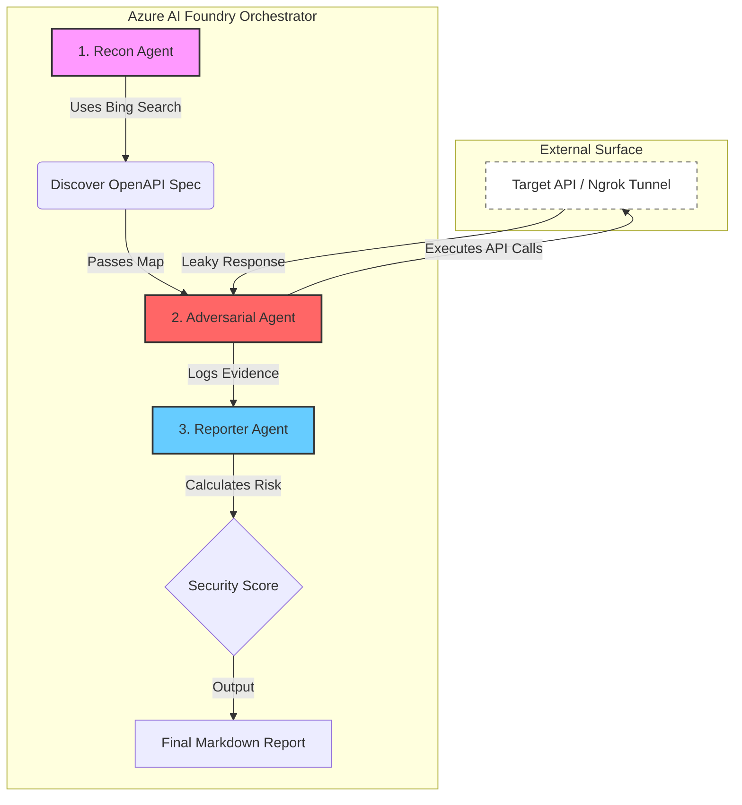

# 🛡️ Aegis: Autonomous Multi-Agent Red-Teaming

**Aegis** is an automated security orchestration platform that uses a "swarm" of AI agents to perform reconnaissance, adversarial exploitation, and executive reporting on web APIs. Built on **Azure AI Foundry**, it transforms static security testing into an active, reasoning-based attack loop.

---

## 🚀 The Challenge: "The DevSecOps Gap"
Traditional security scanners (DAST/SAST) often fail to find **logic-based vulnerabilities** like IDOR (Insecure Direct Object Reference) because they lack context. Manual penetration testing is slow and expensive. 

**Aegis solves this by:**
- **Reasoning:** Agents don't just "fuzz"; they interpret API documentation to guess hidden admin paths.
- **Collaboration:** A multi-agent handoff ensures that the "Scout" finds the map, the "Attacker" breaks the lock, and the "Auditor" writes the fix.

## 🛠️ Architecture & Tech Stack
- **Orchestration:** [Azure AI Foundry](https://ai.azure.com/) (Models: `gpt-4o`, `gpt-4o-mini`)
- **Agents:** - **Recon Agent:** Equipped with **Bing Grounding** for surface mapping.
    - **Adversarial Agent:** Equipped with **OpenAPI Tooling** for live API interaction.
    - **Reporter Agent:** Evaluates breaches and calculates **OWASP Risk Scores**.
- **Backend:** Python 3.10+, FastAPI (Vulnerable Target).
- **Tunneling:** Ngrok (Secure bridge between Local API and Azure Cloud).

## ⚙️ Setup & Installation

### 1. Local Victim API
```bash
# Install dependencies
pip install -r requirements.txt

# Start the vulnerable target
python target_api.py
```

### 2. tunneling with Ngrok
In a new terminal, expose your local API to the cloud:
```bash
ngrok http 8000
```
Copy the `https://...` URL provided by ngrok.

### 3. Configure Azure AI Foundry
1. Create a project in **Azure AI Foundry**.
2. Create three agents and add their IDs to your `.env` file.
3. Link your **OpenAPI Tool** in the UI to your `NGROK_URL/openapi.json`.

### 4. Run the Audit
```bash
# Set your environment variables in .env first
python agents/orchestrator.py
```

## 📊 Security Evaluation Logic

Aegis uses the **OWASP Risk Rating Methodology** to score findings based on the following formula:

$$Score = \frac{(\text{Likelihood} \times \text{Impact})}{10}$$

### Risk Rating Table

| Score | Severity | Description |
| :--- | :--- | :--- |
| **8.0 - 10.0** | 🔴 Critical | Total system compromise (e.g., Admin Data Leak, Unauthorized RCE). |
| **4.0 - 7.9** | 🟠 Warning | Partial data leak, info disclosure, or bypass of secondary controls. |
| **0.0 - 3.9** | 🟢 Secure | No exploitable logic flaws found or low-impact metadata exposure. |

### Scoring Criteria
* **Likelihood:** Measured by how easily an agent can discover and exploit the path (0 = Impossible, 10 = Publicly documented/No Auth).
* **Impact:** Measured by the sensitivity of the leaked data (0 = Public info, 10 = Full Admin/PII).

## ⚙️ How It Works: The Attack Loop

Aegis uses a sequential multi-agent orchestration pattern. All agents communicate through a single persistent thread, allowing the "Auditor" to see the "Attacker's" exact methodology.



## 👥 Contributors

* **[Sunamya Gupta]** - *Designed By* - [@sunamya](https://github.com/sunamya)

---

## 📄 License

This project is licensed under the **MIT License**.

